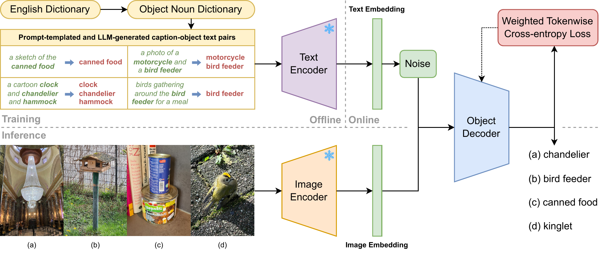
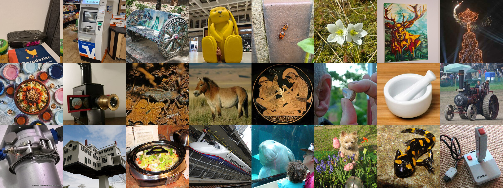
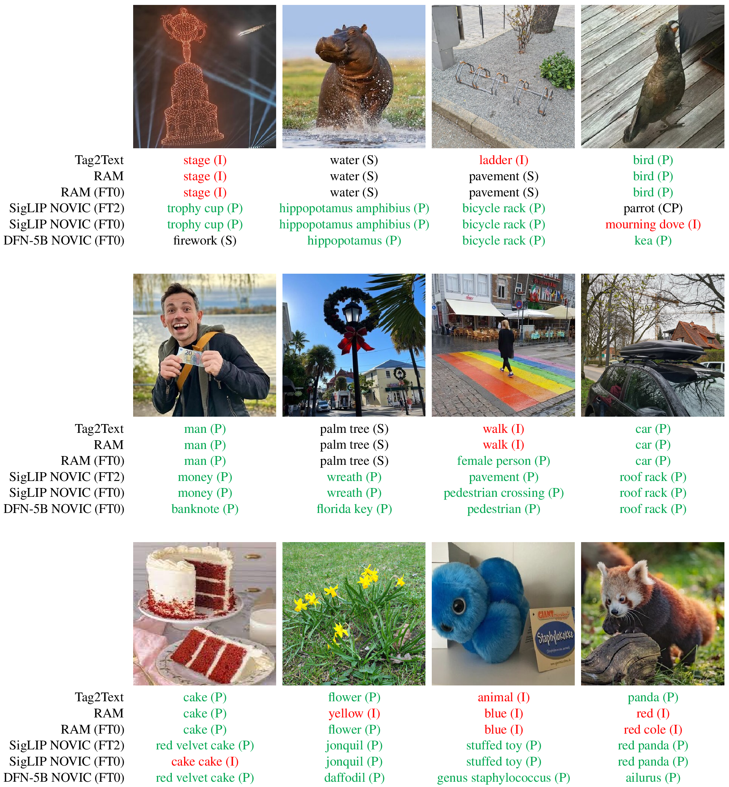
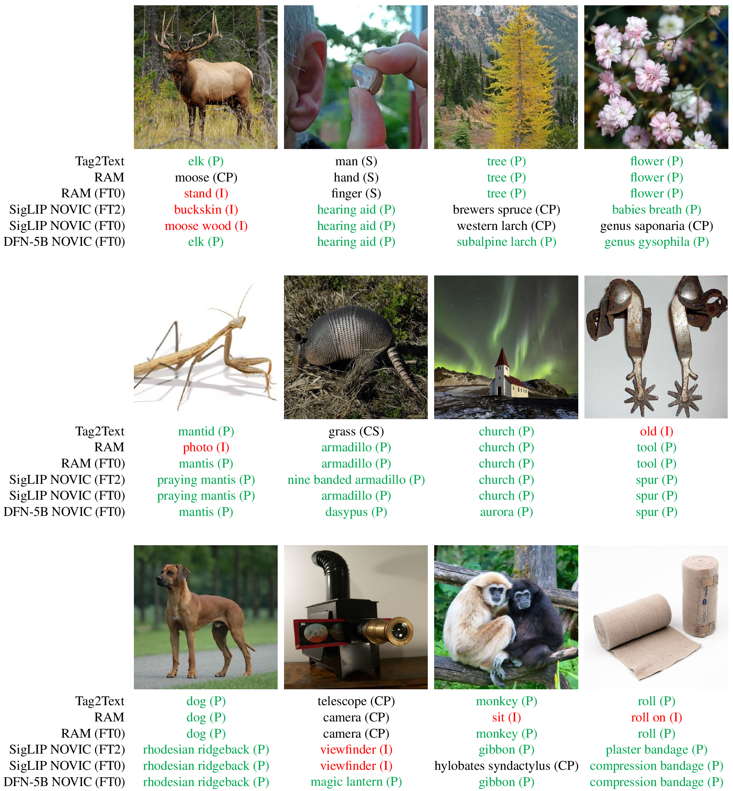

# NOVIC: Unconstrained Open Vocabulary Image Classification

[](https://paperswithcode.com/sota/open-vocabulary-image-classification-on-ovic?p=unconstrained-open-vocabulary-image)
[](https://paperswithcode.com/sota/open-vocabulary-image-classification-on-ovic-1?p=unconstrained-open-vocabulary-image)
[](https://paperswithcode.com/sota/open-vocabulary-image-classification-on-ovic-3?p=unconstrained-open-vocabulary-image)
[](https://paperswithcode.com/sota/open-vocabulary-image-classification-on-ovic-2?p=unconstrained-open-vocabulary-image)
[](https://paperswithcode.com/sota/image-classification-on-imagenet?p=unconstrained-open-vocabulary-image)

**Main Author:** Philipp Allgeuer

Code release corresponding to the [WACV 2025 paper](https://www.arxiv.org/abs/2407.11211) (also on [paperswithcode](https://paperswithcode.com/paper/unconstrained-open-vocabulary-image)):

Philipp Allgeuer, Kyra Ahrens, and Stefan Wermter: *Unconstrained Open Vocabulary Image Classification: Zero-Shot Transfer from Text to Image via CLIP Inversion*

**Video:** [WACV 2025 presentation](https://youtu.be/vyR2QHUH9NY) (also as `mp4` in `doc` folder, along with paper PDF and poster PDF)

## Overview

**TL;DR:** Given an image and nothing else (i.e. no prompts or candidate labels), NOVIC can generate an accurate textual fine-grained classification label in *real-time*, with coverage of the vast majority of the English language.



NOVIC is an innovative uNconstrained Open Vocabulary Image Classifier that uses an autoregressive transformer to generatively output classification labels as language. Leveraging the extensive knowledge of CLIP models, NOVIC harnesses the embedding space to enable zero-shot transfer from pure text to images. Traditional CLIP models, despite their ability for open vocabulary classification, require an exhaustive prompt of potential class labels, restricting their application to images of known content or context. To address this, NOVIC uses an "object decoder" model that is trained on a large-scale 92M-target dataset of templated object noun sets and LLM-generated captions to always output the object noun in question. This effectively inverts the CLIP text encoder and allows textual object labels to be generated directly from image-derived embedding vectors, without requiring any a priori knowledge of the potential content of an image. NOVIC has been tested on a mix of manually and web-curated datasets, as well as standard image classification benchmarks, and achieves fine-grained prompt-free prediction scores of up to 87.5%, a strong result considering the model must work for any conceivable image and without any contextual clues.


At the heart of the NOVIC architecture is the *object decoder*, which effectively inverts the CLIP text encoder, and learns to map CLIP embeddings to object noun classification labels in the form of tokenized text. During training, a synthetic text-only dataset is used to train the object decoder to map the CLIP text embeddings corresponding to templated/generated captions to the underlying target object nouns. During inference, zero-shot transfer is used to map CLIP image embeddings (as opposed to text embeddings) to predicted object nouns. The ability of the object decoder to generalize from text embeddings to image embeddings is non-trivial, as there is a huge modality gap between the two types of embeddings (for all CLIP models), with the embeddings in fact occupying two completely disjoint areas of the embedding space, with much gap in-between.

## Datasets

In addition to a synthetic textual multiset dataset generated from the [Object Noun Dictionary](https://github.com/pallgeuer/object_noun_dictionary), caption-object pairs were also generated using an LLM, and are available here (see also [NOVIC Caption-Object Data](https://paperswithcode.com/dataset/novic-caption-object-data) on paperswithcode):

* [LLM-generated captions dataset (JSON)](https://www2.informatik.uni-hamburg.de/wtm/corpora/novic/captions_dataset.json): For more information, refer to the [paper](https://www.arxiv.org/abs/2407.11211) and the [dataset page](https://www.inf.uni-hamburg.de/en/inst/ab/wtm/research/corpora.html#novic)

Three datasets were also constructed and annotated for the purpose of testing open vocabulary image classification performance. These are available here (see also [OVIC Datasets](https://paperswithcode.com/dataset/ovic-datasets) on paperswithcode):

* [World](https://www2.informatik.uni-hamburg.de/wtm/corpora/ovic_datasets/world_dataset.zip): 272 images of which the grand majority are originally sourced (have never been on the internet) from 10 countries by 12 people, with an active focus on covering as wide and varied concepts as possible, including unusual, deceptive and/or indirect representations of objects,
* [Wiki](https://www2.informatik.uni-hamburg.de/wtm/corpora/ovic_datasets/wiki_dataset.zip): 1000 Wikipedia lead images sampled from a scraped pool of 18K,
* [Val3K](https://www2.informatik.uni-hamburg.de/wtm/corpora/ovic_datasets/val3k_dataset.zip): 3000 images from the ImageNet-1K validation set, sampled uniformly across the classes.



For more information, refer to the [paper](https://www.arxiv.org/abs/2407.11211) and the [open vocabulary image classification datasets page](https://www.inf.uni-hamburg.de/en/inst/ab/wtm/research/corpora.html#ovic-datasets). These datasets are distributed under the Creative Commons [CC BY-NC-SA 4.0](https://creativecommons.org/licenses/by-sa/4.0/) license.

## Installation and Test

**Note:** When executing commands from the subsections below, make sure the environment variables defined in one subsection that are needed in another are preserved (e.g. `NOVIC` and `DATASETS`).

### Code

To get started, choose a path and clone this repository into it:
```bash
LOC=/path/to/parent/dir  # <-- Set the real path to use, e.g. ~/Code
cd "$LOC" && git clone https://github.com/pallgeuer/novic.git
NOVIC="$LOC/novic"
cd "$NOVIC"
```

### Environment

Create a conda environment `novic` for the project (install [Miniconda](https://docs.anaconda.com/miniconda/install/) if you don't have either Miniconda or Anaconda yet, and we heavily recommend enabling the [libmamba solver](https://www.anaconda.com/blog/a-faster-conda-for-a-growing-community)):
```bash
NENV=novic
conda create -y -n "$NENV" python=3.10
conda activate "$NENV"
conda list | grep -q '^libgcc-ng ' && conda update -y -c conda-forge libgcc-ng
conda list | grep -q '^libstdcxx-ng ' && conda update -y -c conda-forge libstdcxx-ng
conda install -y -c pytorch -c nvidia pytorch=2.1.2 torchvision pytorch-cuda=11.8 cuda-version=11.8 'libtiff<4.5' 'numpy<2'
conda install -y -c conda-forge datasets filelock 'huggingface_hub<1' packaging pyyaml regex requests safetensors tqdm certifi openssl ca-certificates
conda install -y -c conda-forge 'hydra-core>1' omegaconf
conda install -y -c conda-forge transformers==4.38.2  # <-- Other versions most likely work (if not using libmamba, explicit version avoids conda dependency mismanagement wrt optimum, but takes a LONG time anyway)
conda install -y -c conda-forge optimum==1.17.1  # <-- Other versions most likely work (if not using libmamba, explicit version avoids conda dependency mismanagement wrt transformers, but takes a LONG time anyway)
conda install -y -c conda-forge accelerate ftfy timm sentencepiece unidecode tabulate
pip check  # <-- Verify that there was no dependency mismanagement by conda during the install process
pip list --outdated  # <-- Verify that there was no dependency mismanagement by conda during the install process that can unfortunately sometimes lead to severely old package versions being chosen for no real reason (conda update those if applicable)
pip install wandb  # <-- Pip install so that can be updated more cleanly in future
pip install openai opencv-python
pip install open_clip_torch==2.23 git+https://github.com/openai/CLIP.git
pip check
```
If you're having trouble with `conda` failing or doing unexpected things (unfortunately that happens as packages and solvers continue to be updated), try enabling (or disabling) the [libmamba solver](https://www.anaconda.com/blog/a-faster-conda-for-a-growing-community), or try outright installing everything with `pip` after the line above that installs PyTorch (pip is usually very stable, so that should always work).

Set up Weights and Biases (an account is needed if you wish to use the Wandb integration, otherwise just always use `wandb=False` on the `./train.py` command line):
```bash
conda activate "$NENV"
wandb login  # <-- Get the Wandb API key from: https://wandb.ai/authorize
export WANDB_API_KEY=...  # <-- Alternatively, to set the Wandb API key for a single session (replace ... with the key)
```
Test that the `train.py` script finds all imports and can run:
```bash
cd "$NOVIC"
conda activate "$NENV"
./train.py --help
```

### NOVIC/OVIC Datasets

Download the LLM-generated captions dataset:
```bash
wget -P "$NOVIC/extras/data" https://www2.informatik.uni-hamburg.de/wtm/corpora/novic/captions_dataset.json
```
Download and extract the World dataset:
```bash
wget -P "$NOVIC/extras/world" https://www2.informatik.uni-hamburg.de/wtm/corpora/ovic_datasets/world_dataset.zip
unzip -q "$NOVIC/extras/world/world_dataset.zip" -d "$NOVIC/extras/world" && rm "$NOVIC/extras/world/world_dataset.zip"
```
Download and extract the Wiki dataset:
```bash
wget -P "$NOVIC/extras/wiki" https://www2.informatik.uni-hamburg.de/wtm/corpora/ovic_datasets/wiki_dataset.zip
unzip -q "$NOVIC/extras/wiki/wiki_dataset.zip" -d "$NOVIC/extras/wiki" && rm "$NOVIC/extras/wiki/wiki_dataset.zip"
```
Download and extract the Val3K dataset:
```bash
wget -P "$NOVIC/extras/val3k" https://www2.informatik.uni-hamburg.de/wtm/corpora/ovic_datasets/val3k_dataset.zip
unzip -q "$NOVIC/extras/val3k/val3k_dataset.zip" -d "$NOVIC/extras/val3k" && rm "$NOVIC/extras/val3k/val3k_dataset.zip"
```
The datasets are now available in the `extras` subdirectory of the NOVIC repository.

### Classification Datasets

Download and configure a few classification benchmark datasets in order to test the embedders are working (compact instructions to download various classification benchmark datasets, including ImageNet-1K, can be found [here](https://github.com/pallgeuer/ReLish/blob/392de1cfbf346131ab1fc47a01eb620505ccc1af/benchmark/commands.txt#L118) under the heading `CLASSIFICATION DATASETS`):
```bash
DATASETS=/path/to/datasets/dir  # <-- This folder should exist and will be the location of the downloaded datasets, e.g. "$NOVIC/datasets" or ~/Datasets

# CIFAR10 and CIFAR100
CIFAR_ROOT="$DATASETS"/CIFAR
wget -P "$CIFAR_ROOT" https://www.cs.toronto.edu/~kriz/cifar-10-python.tar.gz
tar -xf "$CIFAR_ROOT"/cifar-10-python.tar.gz -C "$CIFAR_ROOT" && rm "$CIFAR_ROOT"/cifar-10-python.tar.gz
wget -P "$CIFAR_ROOT" https://www.cs.toronto.edu/~kriz/cifar-100-python.tar.gz
tar -xf "$CIFAR_ROOT"/cifar-100-python.tar.gz -C "$CIFAR_ROOT" && rm "$CIFAR_ROOT"/cifar-100-python.tar.gz
rm -rf "$CIFAR_ROOT"/cifar-100-python/file.txt~

# Imagenette
IMAGENETTE_ROOT="$DATASETS"/Imagenette
wget -P "$IMAGENETTE_ROOT" https://s3.amazonaws.com/fast-ai-imageclas/imagenette2-320.tgz
tar -xf "$IMAGENETTE_ROOT"/imagenette2-320.tgz -C "$IMAGENETTE_ROOT" && rm "$IMAGENETTE_ROOT"/imagenette2-320.tgz

# Food-101
FOOD_ROOT="$DATASETS"/Food101
wget -P "$FOOD_ROOT" http://data.vision.ee.ethz.ch/cvl/food-101.tar.gz
tar -xf "$FOOD_ROOT"/food-101.tar.gz -C "$FOOD_ROOT" && rm "$FOOD_ROOT"/food-101.tar.gz

# ImageNet-1K
IMAGENET1K_ROOT="$DATASETS"/ImageNet1K
mkdir "$IMAGENET1K_ROOT"
wget -P "$IMAGENET1K_ROOT/ILSVRC-CLS" https://image-net.org/data/ILSVRC/2012/ILSVRC2012_img_val.tar
mkdir "$IMAGENET1K_ROOT/ILSVRC-CLS/val" && tar -xf "$IMAGENET1K_ROOT"/ILSVRC-CLS/ILSVRC2012_img_val.tar -C "$IMAGENET1K_ROOT/ILSVRC-CLS/val" && rm "$IMAGENET1K_ROOT"/ILSVRC-CLS/ILSVRC2012_img_val.tar
(cd "$IMAGENET1K_ROOT/ILSVRC-CLS/val"; wget -qO- https://raw.githubusercontent.com/soumith/imagenetloader.torch/master/valprep.sh | bash; )
find "$IMAGENET1K_ROOT/ILSVRC-CLS/val" -name "*.JPEG" | wc -l  # <-- Should be 50000
```

### Embedder Zero-Shot Performance Test

Consider installing and running [nvitop](https://nvitop.readthedocs.io/en/latest/) (like htop but for nvidia-smi-like information) before continuing (requires `pipx` to be installed first as shown):
```bash
# Install pipx
python3 -m pip install --user pipx  # <-- To upgrade pipx in future: python3 -m pip install --user --upgrade pipx
~/.local/bin/pipx completions

# Manually add/append the following lines to the bashrc
vim ~/.bashrc
	function AddToPath() { echo "$PATH" | /bin/grep -Eq "(^|:)$1($|:)" || export PATH="$1${PATH:+:${PATH}}"; }
	AddToPath ~/.local/bin
	eval "$(register-python-argcomplete pipx)"

# Install nvitop
pipx install nvitop  # <-- Installs into venv: ~/.local/pipx/venvs/nvitop
nvitop  # <-- Available globally (also: nvisel)
```
Test the zero-shot classification performance of two different embedders on some of the datasets (requires approx. 11GiB GPU memory, use e.g. `batch_size_image=32` for less GPU memory requirements):
```bash
cd "$NOVIC"
conda activate "$NENV"
DATASETS=/path/to/datasets/dir  # <-- Replace with real root path of the downloaded datasets!
for DSET in CIFAR10 Food101 ImageNet1K; do
    for EMBEDDER in openclip:timm/ViT-B-16-SigLIP openclip:apple/DFN5B-CLIP-ViT-H-14-378; do
        ./train.py action=embedder_zero_shot cls_dataset_root="$DATASETS" cls_dataset="$DSET" embedder_spec="$EMBEDDER" batch_size_image=128
    done
done
```
If everything is set up and functioning correctly, you should get values very close to the following:
| Model                                  | CIFAR10 | Food-101 | ImageNet-1K |
|----------------------------------------|---------|----------|-------------|
| openclip:timm/ViT-B-16-SigLIP          | 92.33%  | 91.54%   | 76.06%      |
| openclip:apple/DFN5B-CLIP-ViT-H-14-378 | 98.79%  | 96.18%   | 84.34%      |

## Scripts

There are three main scripts:
* `train.py`: Allows creation, caching and management of datasets, as well as model training, evaluation, inference, and much more. The action to perform is supplied using `action=...` on the command line. Refer to `config/train.yaml` for descriptions of all possible actions, embedder models, and command line arguments.
* `dataset_annotation.py`: Tool to annotate model predictions (JSON) made on an image set so that prediction scores can be computed (human annotation).
* `gpt_annotation.py`: Uses multimodal OpenAI LLMs to perform 'ground truth' annotation of model predictions (JSON) made on an image set so that prediction scores can be computed (LLM annotation).

In order to train a model, the actions would be (given a frequency threshold like e.g. FT2) to first create embedding caches corresponding to the multiset dataset as well as the LLM-generated captions, as well as a single embedding cache that merges both. Then, a model can be trained using the `train` action. The `eval`, `eval_cls`, `eval_cls_decoding`, and `infer` actions can be used to check how well a trained model performs and/or inference it on isolated images or an image set. Prediction JSONs can also be generated. Wandb results as well as prediction JSONs can then be used with the `format_wandb` and `format_preds` actions to present tables of results and compute prediction scores and such. Overall scores that include label specificity can be computed using the files in the `extras/specificity/` directory.

## Model Checkpoints

The following table summarizes the available NOVIC checkpoints (`-` implies no value is available due to extra human annotations being needed, *Embed Speed* is on an RTX A6000 with batch size 256 and `float16` AMP):

| Link                                                                                                       | Checkpoint           | Tag | Embedder                               | Embed Speed | Freq Thres | World-H (with specificity) | Wiki-H (with specificity) | Wiki-L | CIFAR10 | ImageNet-1K |
|------------------------------------------------------------------------------------------------------------|----------------------|-----|----------------------------------------|-------------|------------|----------------------------|---------------------------|--------|---------|-------------|
| [ZIP](https://github.com/pallgeuer/novic/releases/download/v1.0.0/vitb16_ft2_ta4_ovod_20240610_105233.zip) | ovod_20240610_105233 | ta4 | openclip:timm/ViT-B-16-SigLIP          | 1163 img/s  | FT2        | 79.56% (78.92%)            | 71.89% (-)                | 64.60% | 90.86%  | 67.91%      |
| [ZIP](https://github.com/pallgeuer/novic/releases/download/v1.0.0/so400m_ft2_yb3_ovod_20240626_001447.zip) | ovod_20240626_001447 | yb3 | openclip:timm/ViT-SO400M-14-SigLIP     | 300 img/s   | FT2        | 88.53% (-)                 | - (-)                     | 72.15% | 95.52%  | 75.30%      |
| [ZIP](https://github.com/pallgeuer/novic/releases/download/v1.0.0/dfn5bl_ft2_ya2_ovod_20240620_162925.zip) | ovod_20240620_162925 | ya2 | openclip:apple/DFN5B-CLIP-ViT-H-14-378 | 56.2 img/s  | FT2        | 87.94% (87.13%)            | 80.13% (79.02%)           | 75.70% | 97.04%  | 75.77%      |
| [ZIP](https://github.com/pallgeuer/novic/releases/download/v1.0.0/dfn5bl_ft0_ye2_ovod_20240628_142131.zip) | ovod_20240628_142131 | ye2 | openclip:apple/DFN5B-CLIP-ViT-H-14-378 | 56.2 img/s  | FT0        | 88.64% (88.27%)            | 79.13% (78.16%)           | 74.85% | 96.15%  | 75.60%      |

For the most diverse predictions with very high prediction performance, choose `ovod_20240628_142131`. For slightly more stable predictions with similar performance all round, choose `ovod_20240620_162925`. For faster inference speeds while maintaining very high prediction performance, choose `ovod_20240626_001447`. For very fast inference speed with high prediction performance, choose `ovod_20240610_105233`.

### Checkpoint Details

Here are details of all the released checkpoints, with the reproducible commands shown that were used to prepare the required embedding caches and train on them.

---

**Checkpoint ta4:** *ovod_20240610_105233/ovod_chunk0899_20240612_005748.train* [[ZIP](https://github.com/pallgeuer/novic/releases/download/v1.0.0/vitb16_ft2_ta4_ovod_20240610_105233.zip)]  
**Performance:** World-H 79.56% (78.92% with specificity), Wiki-H 71.89%, Wiki-L 64.60%, ImageNet-1K 67.91%  
**Dataset preparation:** Embedder `openclip:timm/ViT-B-16-SigLIP` with frequency threshold FT2
```bash
./train.py action=cache_noun_multiset vocab_thres=2 save_embedding_cache=noun_multiset3_cache_ft2.bin multi_target_freq="[1, 1, 1]"
./train.py action=cache_captions captions_path='$SOURCE/extras/data/captions_dataset.json' save_embedding_cache=captions_cache_ft2.bin vocab_thres=2 template_multiplier=10
./train.py action=merge_caches save_embedding_cache=noun_multiset3c2_cache_ft2.bin embedding_datasets="['noun_multiset3_cache_ft2.bin', 'captions_cache_ft2.bin', 'captions_cache_ft2.bin', 'captions_cache_ft2.bin', 'captions_cache_ft2.bin']"
```
**Trained with command:**
```bash
./train.py action=train embedding_dataset=noun_multiset3c2_cache_ft2.bin multi_target=True use_weights=True noise_scheme=GaussElemUniformAngle noise_vec_norm=3.25 noise_angle_min=45 noise_angle_max=75 noise_mix_ratio=0.15 accum_factor=16
```

---

**Checkpoint yb3:** *ovod_20240626_001447/ovod_chunk0899_20240627_112729.train* [[ZIP](https://github.com/pallgeuer/novic/releases/download/v1.0.0/so400m_ft2_yb3_ovod_20240626_001447.zip)]  
**Performance:** World-H 88.53%, Wiki-L 72.15%, ImageNet-1K 75.30%  
**Dataset preparation:** Embedder `openclip:timm/ViT-SO400M-14-SigLIP` with frequency threshold FT2
```bash
./train.py action=cache_noun_multiset embedder_spec=openclip:timm/ViT-SO400M-14-SigLIP vocab_thres=2 save_embedding_cache=so400m_multiset3_cache_ft2.bin multi_target_freq="[1, 1, 1]"
./train.py action=cache_captions embedder_spec=openclip:timm/ViT-SO400M-14-SigLIP captions_path='$SOURCE/extras/data/captions_dataset.json' save_embedding_cache=so400m_captions_cache_ft2.bin vocab_thres=2 template_multiplier=10
./train.py action=merge_caches embedder_spec=openclip:timm/ViT-SO400M-14-SigLIP save_embedding_cache=so400m_multiset3c2_cache_ft2.bin embedding_datasets="['so400m_multiset3_cache_ft2.bin', 'so400m_captions_cache_ft2.bin', 'so400m_captions_cache_ft2.bin', 'so400m_captions_cache_ft2.bin', 'so400m_captions_cache_ft2.bin']"
```
**Trained with command:**
```bash
./train.py action=train embedder_spec=openclip:timm/ViT-SO400M-14-SigLIP embedding_dataset=so400m_multiset3c2_cache_ft2.bin multi_target=True use_weights=True noise_scheme=GaussElemUniformAngle noise_vec_norm=3.25 noise_angle_min=45 noise_angle_max=75 noise_mix_ratio=0.15 accum_factor=16
```

---

**Checkpoint ya2:** *ovod_20240620_162925/ovod_chunk0899_20240621_202727.train* [[ZIP](https://github.com/pallgeuer/novic/releases/download/v1.0.0/dfn5bl_ft2_ya2_ovod_20240620_162925.zip)]  
**Performance:** World-H 87.94% (87.13% with specificity), Wiki-H 80.13% (79.02% with specificity), Wiki-L 75.70%, ImageNet-1K 75.77%  
**Dataset preparation:** Embedder `openclip:apple/DFN5B-CLIP-ViT-H-14-378` with frequency threshold FT2
```bash
./train.py action=cache_noun_multiset embedder_spec=openclip:apple/DFN5B-CLIP-ViT-H-14-378 vocab_thres=2 save_embedding_cache=dfn5bl_multiset3_cache_ft2.bin multi_target_freq="[1, 1, 1]"
./train.py action=cache_captions embedder_spec=openclip:apple/DFN5B-CLIP-ViT-H-14-378 captions_path='$SOURCE/extras/data/captions_dataset.json' save_embedding_cache=dfn5bl_captions_cache_ft2.bin vocab_thres=2 template_multiplier=10
./train.py action=merge_caches embedder_spec=openclip:apple/DFN5B-CLIP-ViT-H-14-378 save_embedding_cache=dfn5bl_multiset3c2_cache_ft2.bin embedding_datasets="['dfn5bl_multiset3_cache_ft2.bin', 'dfn5bl_captions_cache_ft2.bin', 'dfn5bl_captions_cache_ft2.bin', 'dfn5bl_captions_cache_ft2.bin', 'dfn5bl_captions_cache_ft2.bin']"
```
**Trained with command:**
```bash
./train.py action=train embedder_spec=openclip:apple/DFN5B-CLIP-ViT-H-14-378 embedding_dataset=dfn5bl_multiset3c2_cache_ft2.bin multi_target=True use_weights=True noise_scheme=GaussElemUniformAngle noise_vec_norm=3.25 noise_angle_min=45 noise_angle_max=75 noise_mix_ratio=0.15 accum_factor=16
```

---

**Checkpoint ye2:** *ovod_20240628_142131/ovod_chunk0433_20240630_235415.train* [[ZIP](https://github.com/pallgeuer/novic/releases/download/v1.0.0/dfn5bl_ft0_ye2_ovod_20240628_142131.zip)]  
**Performance:** World-H 88.64% (88.27% with specificity), Wiki-H 79.13% (78.16% with specificity), Wiki-L 74.85%, ImageNet-1K 75.60%  
**Dataset preparation:** Embedder `openclip:apple/DFN5B-CLIP-ViT-H-14-378` with frequency threshold FT0
```bash
./train.py action=cache_noun_multiset embedder_spec=openclip:apple/DFN5B-CLIP-ViT-H-14-378 vocab_thres=0 save_embedding_cache=dfn5bl_multiset3_cache_ft0.bin multi_target_freq="[1, 1, 1]"
./train.py action=cache_captions embedder_spec=openclip:apple/DFN5B-CLIP-ViT-H-14-378 captions_path='$SOURCE/extras/data/captions_dataset.json' save_embedding_cache=dfn5bl_captions_cache_ft0.bin vocab_thres=0 template_multiplier=10
./train.py action=merge_caches embedder_spec=openclip:apple/DFN5B-CLIP-ViT-H-14-378 save_embedding_cache=dfn5bl_multiset3c2_cache_ft0.bin embedding_datasets="['dfn5bl_multiset3_cache_ft0.bin', 'dfn5bl_captions_cache_ft0.bin', 'dfn5bl_captions_cache_ft0.bin', 'dfn5bl_captions_cache_ft0.bin', 'dfn5bl_captions_cache_ft0.bin']"
```
**Trained with command:**
```bash
./train.py action=train embedder_spec=openclip:apple/DFN5B-CLIP-ViT-H-14-378 embedding_dataset=dfn5bl_multiset3c2_cache_ft0.bin multi_target=True use_weights=True noise_scheme=GaussElemUniformAngle noise_vec_norm=3.25 noise_angle_min=45 noise_angle_max=75 noise_mix_ratio=0.15 accum_factor=16
```

### Using a Checkpoint

Let's say you wish to use the following checkpoint (refer also to [Releases](https://github.com/pallgeuer/novic/releases)):
```bash
RELEASE=v1.0.0
OVODSTAMP=ovod_20240628_142131
CHECKPOINT="dfn5bl_ft0_ye2_${OVODSTAMP}.zip"
EMBEDDER=openclip:apple/DFN5B-CLIP-ViT-H-14-378
```
Recall the environment variables from above:
```bash
NOVIC=/path/to/novic  # <-- Set the real path of the cloned NOVIC repository
NENV=novic  # <-- Conda environment to use
DATASETS=/path/to/datasets/dir  # <-- Set the real path of the directory containing the classification datasets
export WANDB_API_KEY=...  # <-- Set Wandb API key (if not logged in, or otherwise set wandb=False to disable)
cd "$NOVIC"
conda activate "$NENV"
```
First download and extract the checkpoint to the `outputs` directory:
```bash
wget -P "$NOVIC/outputs" "https://github.com/pallgeuer/novic/releases/download/${RELEASE}/${CHECKPOINT}"
unzip -q "$NOVIC/outputs/${CHECKPOINT}" -d "$NOVIC/outputs" && rm "$NOVIC/outputs/${CHECKPOINT}"
```
To **inference the model on particular images of yours**, specified by path to each image:
```bash
./train.py action=infer wandb=False load_models="['$OVODSTAMP']" embedder_spec="$EMBEDDER" gencfgs="['beam_k10_vnone_gp_t1_a0']" batch_size_image=128 infer_image_dir='$SOURCE/extras/world' infer_images="['black_dog.jpg', 'brown_bear.jpg', 'canned_food.jpg', 'cigarette_butts.jpg', 'coonskin_cap.jpeg', 'defibrillator.jpg', 'electronic_scale.jpg', 'fried_eggs.jpg', 'glasses_case.jpg', 'grilled_salmon_wedges.jpg', 'padlock.jpg', 'piggy_bank.jpg', 'plushie.jpg', 'projector.jpg', 'red_velvet_cake.jpeg', 'satellite_dish.jpg', 'unicorn.jpg', 'wedding_cake.jpg']"
# Note: Open the input images to verify the correctness of the generated labels (black_dog.jpg is a black labrador retriever, plushie.jpg is a plushie representing a Staphylococcus aureus microbe)
```
To evaluate the performance of the model on a classification benchmark, e.g. like ImageNet-1K, do the following (Note: The evaluation speed often improves on successive calls due to the classification dataset then being in page cache already):
```bash
./train.py action=eval_cls_decoding load_models="['$OVODSTAMP']" embedder_spec="$EMBEDDER" cls_dataset_root="$DATASETS" cls_datasets="['CIFAR10', 'ImageNet1K']" cls_split=valid class_names_variant=clip gencfgs="['beam_k10_vnone_gp_t1_a0']" batch_size_image=128
```
To inference all the images in a directory and additionally save the result as a predictions JSON file:
```bash
./train.py action=infer wandb=False infer_log=True infer_pred_json=True load_models="['$OVODSTAMP']" embedder_spec="$EMBEDDER" gencfgs="['beam_k10_vnone_gp_t1_a0']" batch_size_image=128 infer_all_images_dir='$SOURCE/extras/world'
```
Look for the output line starting with `Saved predictions JSON:` to see where in `outputs` the predictions JSON was saved, e.g. in the `ovod_20241122_150958` subdirectory. We can then for instance evaluate the performance of the model on World-H using:
```bash
PREDS=ovod_20241122_150958
./train.py action=format_preds pfmt_type=model_topk_v1 pfmt_sort='model' pfmt_topk=1 load_pred_jsons='["$SOURCE/outputs/'"$PREDS"'"]' pred_image_dir='$SOURCE/extras/world' pred_ann_json='$IMAGEDIR/_class_annotations.json'
```
LLM-annotated ground truths are used by setting `pred_ann_json='$IMAGEDIR/_class_annotations_gpt.json'`. Note that warnings occur if models make predictions that are not annotated, and thus cannot be evaluated. These predictions are by default assumed to be incorrect, thus leading to an underestimation of the model performance. This can be remedied by performing the appropriate annotations, either manually (-H) or using an LLM (-L).

The standard prediction scores give a good idea of correctness, but it is also desired that open vocabulary image classification models provide correct fine-grained classifications as opposed to just correct coarse predictions. We evaluate this by penalizing coarseness in the *overall score*, i.e. the prediction score that accounts for specificity. A model overwhelmingly produces fine-grained correct predictions if the overall score is very close to the prediction score. An example command to calculate the prediction score and overall score for World-H (a `KeyError` is raised if the specificity annotations file does not cover all top-1 model predictions seen in the predictions JSONs):
```bash
extras/specificity/specificity_scores.py --specificity_file extras/specificity/_specificity_annotations.json --pred_dir outputs/"$PREDS" --ann_file extras/world/_class_annotations.json
```

## Example Predictions

Below are some example predictions from the [WACV 2025 paper](https://www.arxiv.org/abs/2407.11211) for World-H and Wiki-H (click on either image for higher resolution). *SigLIP NOVIC (FT2)* refers to the checkpoint `ovod_20240610_105233`, *DFN-5B NOVIC (FT0)* refers to the checkpoint `ovod_20240628_142131`, and Tag2Text and RAM are related work (demonstrating a lack of diversity and specificity in the predicted labels, as well as often missing the true intention of the image, even if at times it can still be considered *primary*). Possible classification scores are *correct primary* (P) in green, *correct secondary* (S), *close primary* (CP), *close secondary* (CS), and *incorrect* (I) in red. Invalid words or combinations, as well as non-nouns, are considered to be *incorrect*.

**World-H examples:**  


**Wiki-H examples:**  


## Anomaly Recognition

In this section we provide the commands specific to using NOVIC for an anomaly recognition scenario. This involves customizing the object noun dictionary, retraining NOVIC with the customized dataset, and then embedding it into a pipeline where:
1) Anomaly detection is performed to identify regions of the image that are unexpected,
2) Bounding box RoIs are established based on the anomalous regions,
3) NOVIC is used to classify the anomalous regions.

To customize the object nouns for a particular scenario:

- Create a Python environment (requires Python 3.12+ whereas NOVIC nominally uses Python 3.10) for using `gpt_batch_api` to customize the object nouns:
  ```bash
  conda create -n novic_gba python=3.12
  conda activate novic_gba
  conda install unidecode
  pip install 'gpt_batch_api>=1.0.3'
  ```

- Run a script to customize the object nouns:
  - Setup:
    ```bash
    cd /PATH/TO/novic
    conda activate novic_gba
    export OPENAI_API_KEY=sk-...  # <-- Set the OpenAI API key
    export WANDB_API_KEY=...      # <-- Set the wandb API key (a project called gpt_batch_api is created/used and can be used to monitor runs in real-time)
    ```
  - Example scenario: Airbus facility
    ```bash
    SCENARIO=airbus
    DESCRIPTION="A camera is used to capture images throughout all indoor areas of an aircraft manufacturing facility that is located in Germany."
    ```
  - Example scenario: NICOL robot
    ```bash
    SCENARIO=nicol
    DESCRIPTION="A camera located in the head of a humanoid robot is used to capture images of human-robot interaction scenarios. The robot is permanently located in the same indoor room in Germany without windows. The table in front of the robot is used as a workspace for the robot to interact with all kinds of common day-to-day objects, toys, tools, plastic food, and more. When rating the likelihood of seeing non-indoor things like a horse or airplane, rate how commonly toys of that particular object noun exist in Germany."
    ```
  - Generate the custom object nouns dataset (in particular the frequencies) based on the chosen scenario:
    ```bash
    # <-- Ensure SCENARIO and DESCRIPTION are defined
    SCENARIO_ARGS=(--scenario "$SCENARIO" --description "$DESCRIPTION" --model gpt-4o-mini-2024-07-18 --cost_input_direct_mtoken 0.150 --cost_input_cached_mtoken 0.075 --cost_input_batch_mtoken 0.075 --cost_output_direct_mtoken 0.600 --cost_output_batch_mtoken 0.300 --wandb_name "object_nouns_${SCENARIO}" --max_remote_ktokens 150000)
    ./custom_object_nouns.py "${SCENARIO_ARGS[@]}"  # <-- Once only to create and run the task
    ./custom_object_nouns.py "${SCENARIO_ARGS[@]}" --wandb_run_id XXXXXXXX  # <-- Continue an existing task (XXXXXXXX is the wandb run ID of the previous command, retrieved from the wandb web interface, normally a sequence of 8 alphanumeric characters)
    ./custom_object_nouns.py "${SCENARIO_ARGS[@]}" --wandb_run_id XXXXXXXX --wipe_failed --force_pretty --max_retries 10  # <-- Retry failed samples of a FINISHED task (as before, XXXXXXXX is the wandb run ID of the first command)

    # Configure the gpt_batch_api wandb project for best viewing of the GPT Batch API library logging
    python -m gpt_batch_api.wandb_configure_view --dst_entity ENTITY  # <-- [Substitute correct ENTITY! / Only need to execute this once ever per project!] Then go to https://wandb.ai/ENTITY/gpt_batch_api and select the saved view called 'GPT Batch API', and then click 'Copy to my workspace'
    ```
  - Verify the output files:
    - `data/object_nouns_airbus.json`
    - `data/object_nouns_nicol.json`

- Train NOVIC on the newly customized object nouns:
  - Setup:
    ```bash
    cd /PATH/TO/novic
    conda activate novic
    SCENARIO=airbus  # <-- Or for example: nicol
    ```
  - Scenario-specific dataset preparation:
    ```bash
    for FT in 6 4 2 0; do ./train.py action=cache_noun_multiset embedder_spec=openclip:apple/DFN5B-CLIP-ViT-H-14-378 vocab_path="\$SOURCE/data/object_nouns_${SCENARIO}.json" vocab_thres="${FT}" save_embedding_cache="${SCENARIO}_dfn5bl_multiset3_cache_ft${FT}.bin" multi_target_freq="[1, 1, 1]"; done
    ```
  - Train NOVIC models with various frequency thresholds:
    ```bash
    for FT in 6 4 2 0; do for i in {1..4}; do ./train.py action=train embedder_spec=openclip:apple/DFN5B-CLIP-ViT-H-14-378 embedding_dataset="${SCENARIO}_dfn5bl_multiset3_cache_ft${FT}.bin" multi_target=True use_weights=True noise_scheme=GaussElemUniformAngle noise_vec_norm=3.25 noise_angle_min=45 noise_angle_max=75 noise_mix_ratio=0.15 accum_factor=16; done; done
    ```

## Citation

If you use this project in your research, please cite this GitHub repository as well as the WACV 2025 paper:

```bibtex
@Misc{github_novic,
    title = {{NOVIC}: {U}nconstrained Open Vocabulary Image Classification},
    author = {Philipp Allgeuer and Kyra Ahrens},
    url = {https://github.com/pallgeuer/novic},
}

@InProceedings{allgeuer_novic_2025,
    author    = {Philipp Allgeuer and Kyra Ahrens and Stefan Wermter},
    title     = {Unconstrained Open Vocabulary Image Classification: {Z}ero-Shot Transfer from Text to Image via {CLIP} Inversion},
    booktitle = {Proceedings of the IEEE/CVF Winter Conference on Applications of Computer Vision (WACV)},
    year      = {2025},
```
